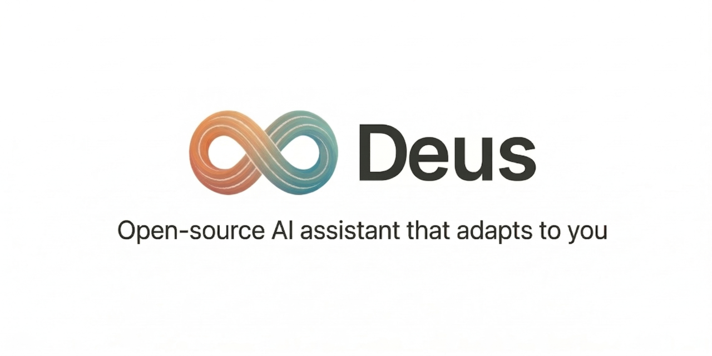
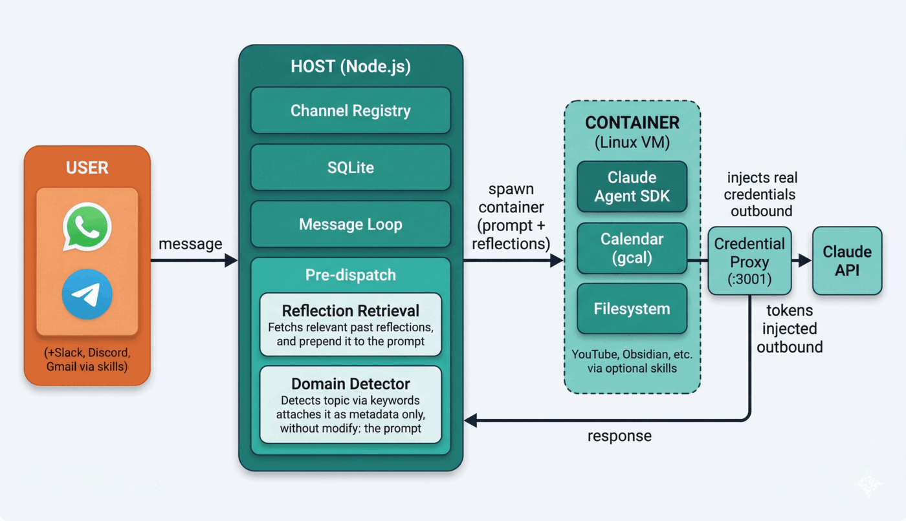
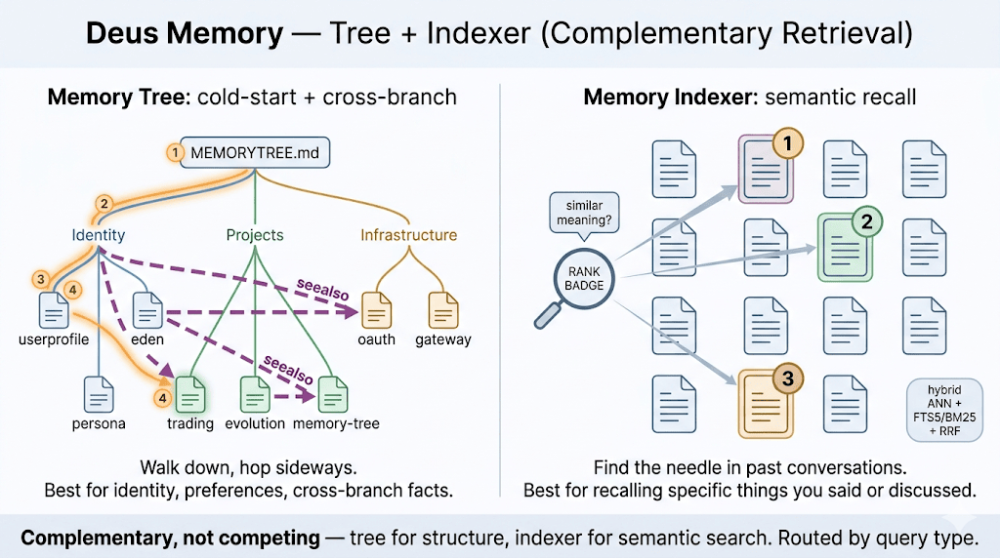
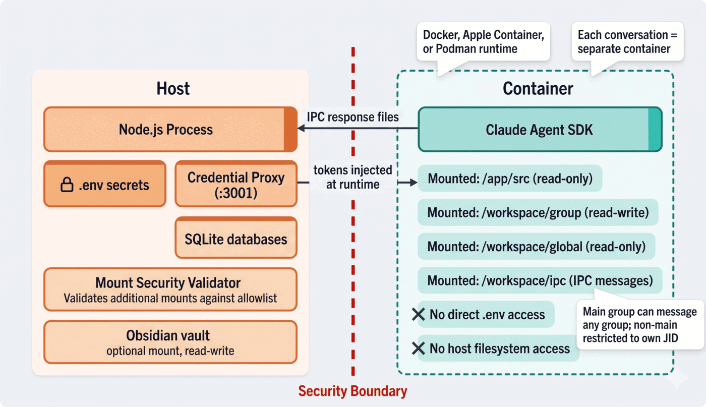

<p align="center">
  
</p>

<p align="center">
  <a href="LICENSE"></a>
  <a href="https://nodejs.org/"></a>
  
</p>

A personal AI assistant that lives in your messaging apps, remembers everything, and gets smarter over time. Built for developers who want a private, self-hosted assistant with container isolation, semantic memory, and a self-improvement loop — all running locally on your machine.

---

## Features

1. **Memory** — Remembers everything across all your conversations. Ask it something you discussed weeks ago and it'll recall it precisely, using semantic search to find the most relevant context.
2. **Messaging apps** — Works inside WhatsApp, Telegram, Slack, Discord, and more. Switch between them freely — memory and context follow you everywhere.
3. **Voice** — Send a voice message and it transcribes and responds. Runs locally on Apple Silicon — nothing leaves your machine.
4. **Vision** — Send a photo or screenshot and it sees and responds to it.
5. **Calendar** — Reads and creates Google Calendar events. Ask what's on your schedule, or tell it to book something.
6. **Web & video** — Fetch YouTube transcripts, summarize videos, or browse the web — all from a chat message.
7. **Scheduled tasks** — Set it to do things automatically on a schedule (daily summaries, weekly recaps, reminders).
8. **Self-improvement** — Scores its own responses over time and learns from both failures and successes. Low-scoring responses generate corrective reflections; high-scoring ones extract positive patterns. Uses DSPy to optimize its own system prompt per domain once enough samples accumulate.
9. **Domain detection** — Automatically tags conversations by topic (marketing, engineering, study, writing, strategy) so the self-improvement loop can learn per-domain patterns and optimize accordingly.
10. **Sandboxed & secure** — Every conversation runs in an isolated Linux container. The AI can't access your host system beyond what you explicitly allow.
11. **External projects** — Run `deus` in any project directory to get a coding agent with your full Deus memory and preferences. Or register a project and work on it through your messaging apps — Deus mounts it into an isolated container, auto-detects the tech stack, and shadows sensitive files automatically.

---

## Architecture

<p align="center">
  
</p>

- One Node.js process on the host. No microservices.
- Each conversation group runs in its own container with an isolated filesystem.
- Domain detection tags conversations by topic so the self-improvement loop learns per-domain patterns.

---

## Quick Start

### Prerequisites

- macOS (Apple Silicon recommended) or Linux
- [Claude Code](https://claude.ai/download) installed and authenticated
- [Docker Desktop](https://www.docker.com/products/docker-desktop/) or [Apple Container](https://github.com/apple/container)
- Node.js 20+, Python 3.11+
- A [Gemini API key](https://aistudio.google.com/apikey) (free tier is enough)

### Setup

```bash
git clone https://github.com/YOUR_USERNAME/deus.git
cd deus
claude
```

Inside the Claude Code prompt:

```
/setup                  # Install deps, configure container runtime, authenticate
/add-whatsapp           # Scan QR code to connect WhatsApp
/add-telegram           # Paste bot token to connect Telegram
```

Start talking:

```
@Deus what's on my calendar tomorrow?
@Deus summarize the YouTube video at <url>
@Deus remind me every Monday morning what I worked on last week
```

---

## Memory System

<p align="center">
  
</p>

| Command | What it does |
|---|---|
| `/compress` | Save the current session to the vault and update the semantic index |
| `/resume` | Load core memory + warm tier (last 3 sessions, free) + cold tier (semantic search) |

A stop hook auto-saves a checkpoint at the end of every Claude Code session with no LLM calls.

---

## Design Principles

| Principle | What it means |
|---|---|
| **Machine-adaptive** | Never hardcode thread counts or resource limits. Scale to available CPU/RAM with env var overrides. |
| **Modular** | Components connect and disconnect cleanly. Adding or removing a channel or integration shouldn't touch unrelated code. |
| **Token-efficient** | Minimize redundant API calls. Cache aggressively. Prefer local models (Ollama) for workloads where quality allows it. |
| **Secure by default** | Credentials never appear in code or git history. Use .env files + .gitignore. Designed as if the repo is already public. |

---

## Self-Improvement

<p align="center">
  
</p>

Every production interaction is scored by a local judge (Ollama or Gemini). Low scores trigger corrective reflexions; high scores extract positive patterns. Both feed into per-domain principles that accumulate over time. Once enough samples exist, DSPy optimizes the system prompt automatically.

---

## Security & Privacy

<p align="center">
  
</p>

- **Container isolation** — Every agent runs in a Linux container (Docker or Apple Container). Agents cannot access your host filesystem beyond explicitly mounted directories.
- **No credentials in code** — All secrets live in `.env` files that are gitignored. The codebase is designed as if the repo is always public.
- **Mount allowlist** — Only directories you explicitly configure are visible to the agent. Everything else is inaccessible.
- **Local-first** — Memory lives in a local SQLite database. Voice transcription runs on-device. No data is sent to external services unless you configure it.

---

## FAQ

**How much does it cost?**
Claude API usage (for the agent) plus optionally Gemini (free tier is sufficient for memory and scoring). Voice transcription is local and free.

**What platforms are supported?**
macOS (Apple Silicon recommended) and Linux. Windows is not supported.

**Can I use a different LLM?**
The core agent uses the Claude Agent SDK — this is architectural and not swappable. The evolution/eval judges can use Ollama (local, free) or Gemini.

**Where is my data?**
All local. Memory in SQLite, session logs optionally in an Obsidian vault, no cloud sync.

**How do I add a new channel?**
Use the skill system: `/add-whatsapp`, `/add-telegram`, `/add-slack`, `/add-discord`, `/add-gmail`. Or build your own channel skill.

**How do I customize behavior?**
Tell Claude Code directly ("change the trigger word to @Max", "make responses shorter") or run `/customize` for guided changes. No config files — the codebase is small enough for Claude to modify safely.

**Where are all the environment variables documented?**
See [`docs/ENVIRONMENT.md`](docs/ENVIRONMENT.md) for the full reference with defaults and descriptions.

---

## Comparison

|  | **Deus** | **[OpenClaw](https://github.com/openclaw/openclaw)** | **[NemoClaw](https://github.com/NVIDIA/NemoClaw)** | **[ZeroClaw](https://github.com/zeroclaw-labs/zeroclaw)** | **Plain Claude** |
|---|---|---|---|---|---|
| **Channels** | 4 (WhatsApp, Telegram, Slack, Discord) | 10+ (Signal, iMessage, Teams...) | Via OpenClaw | 20+ | None |
| **Agent isolation** | Container per conversation (default) | Opt-in Docker | Landlock + seccomp | Rust sandbox | None |
| **Memory** | Semantic vector search + tiered retrieval | Markdown files | Via OpenClaw | Basic persistence | Conversation only |
| **Self-improvement** | Judge → reflexion → DSPy optimization | No | No | No | No |
| **Credential isolation** | Proxy injection (keys never in container) | Keys in env | Policy-controlled | Keys in env | N/A |
| **LLM support** | Claude only | Any provider | Any (via OpenClaw) | Any | Claude only |
| **Codebase** | ~9.5K lines | ~430K lines | OpenClaw wrapper | Single binary | N/A |

**Deus optimizes for depth** (memory, self-improvement, security). **OpenClaw optimizes for breadth** (channels, community, model flexibility). See [docs/benchmarks.md](docs/benchmarks.md) for a detailed comparison.

---

## Project Structure

```
src/
  index.ts              # Orchestrator: state, message loop, agent invocation
  channels/             # WhatsApp and Telegram channel implementations
  container-runner.ts   # Spawns and streams agent containers
  domain-presets.ts     # Keyword-based domain detection for evolution loop tagging
  user-signal.ts        # Detects user feedback signals (positive/negative)
  task-scheduler.ts     # Runs scheduled tasks
  db.ts                 # SQLite operations
  router.ts             # Outbound message routing
  ipc.ts                # File-based IPC watcher
scripts/
  memory_indexer.py     # Semantic memory: index, query, extract, wander
  stop_hook.py          # Auto-checkpoint on session end
  gcal.mjs              # Google Calendar MCP server
evolution/
  judge/                # OllamaJudge + GeminiJudge (DeepEvalBaseLLM wrappers)
  reflexion/            # Reflexion + positive patterns + principles extraction
  optimizer/            # DSPy optimizer: per-domain prompt tuning
  ilog/                 # Interaction log: domain-tagged scored interactions
  db.py                 # Evolution database (SQLite)
  cli.py                # CLI: status, optimize, principles (with --domain)
eval/
  conftest.py           # Fixtures: agent cache, parallel pre-warm, dynamic concurrency
  judge_model.py        # make_judge(): auto-detect Ollama → Gemini → ClaudeProxy
  test_core_qa.py       # Factual Q&A tests
  test_tool_use.py      # Tool-calling tests
  test_safety.py        # Refusal and safety tests
  datasets/             # JSONL test cases
groups/
  */CLAUDE.md           # Per-group memory (isolated per conversation)
```

---

## Built on NanoClaw

Deus is built on **[NanoClaw](https://github.com/qwibitai/nanoclaw)** by [qwibitai](https://github.com/qwibitai) — the core framework providing container-isolated Claude agents, multi-channel messaging, and a skill system for safe customization. This repo extends NanoClaw with semantic memory, voice transcription, a self-improvement loop, and more.

---

## License

MIT
