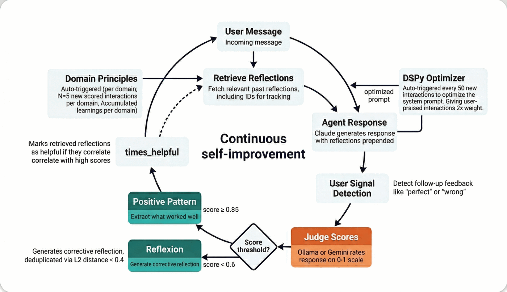

<p align="center">
  
</p>

<p align="center">
  <a href="LICENSE"></a>
  <a href="https://nodejs.org/"></a>
  
</p>

A personal AI assistant that lives in your messaging apps, remembers everything, and gets smarter over time. Built for developers who want a private, self-hosted assistant with container isolation, semantic memory, and a self-improvement loop — all running locally on your machine.

---

## Features

1. **Memory** — Remembers everything across all your conversations. Ask it something you discussed weeks ago and it'll recall it precisely, using semantic search to find the most relevant context.
2. **Messaging apps** — WhatsApp, Telegram, Slack, Discord, and Gmail — each a standalone MCP package you install as needed. Switch between them freely — memory and context follow you everywhere.
3. **Voice** — Send a voice message and it transcribes and responds. Runs locally on Apple Silicon — nothing leaves your machine.
4. **Vision** — Send a photo or screenshot and it sees and responds to it.
5. **Calendar** — Reads and creates Google Calendar events. Ask what's on your schedule, or tell it to book something.
6. **Web & video** — Fetch YouTube transcripts, summarize videos, or browse the web — all from a chat message.
7. **Scheduled tasks** — Set it to do things automatically on a schedule (daily summaries, weekly recaps, reminders).
8. **Self-improvement** — Scores its own responses over time and learns from both failures and successes. Low-scoring responses generate corrective reflections; high-scoring ones extract positive patterns. Uses DSPy to optimize its own system prompt per domain once enough samples accumulate.
9. **Domain detection** — Automatically tags conversations by topic (marketing, engineering, study, writing, strategy) so the self-improvement loop can learn per-domain patterns and optimize accordingly.
10. **Sandboxed & secure** — Every conversation runs in an isolated Linux container. The AI can't access your host system beyond what you explicitly allow.
11. **External projects** — Run `deus` in any project directory to get a coding agent with your full Deus memory and preferences. Or register a project and work on it through your messaging apps — Deus mounts it into an isolated container, auto-detects the tech stack, and shadows sensitive files automatically.

---

## Quick Start

### Prerequisites

- macOS (Apple Silicon recommended), Linux, or Windows
- [Claude Code](https://claude.ai/download) installed and authenticated
- [Docker Desktop](https://www.docker.com/products/docker-desktop/) — the installer handles WSL 2 on Windows automatically
- Node.js 20+, Python 3.11+
- A [Gemini API key](https://aistudio.google.com/apikey) (free tier is enough)

### Setup

```bash
git clone https://github.com/sliamh11/Deus.git
cd Deus
claude
```

Inside the Claude Code prompt:

```
/setup                  # Install deps, configure runtime, build container, onboard
```

`/setup` includes a **Personality Kickstarter** at the end: choose from curated behavioral bundles (universal defaults, developer workflow, student/learner mode), pick individual behaviors à la carte, and optionally seed the self-improvement loop with battle-tested reflections so it isn't starting cold.

> **Switching from another AI?** Give Deus a head start. Paste this prompt into your current AI (ChatGPT, Gemini, etc.) and send the output to Deus in your first conversation:
>
> ```
> I'm switching to a new AI assistant called Deus. Generate a structured summary
> about me that I can give it so it knows me from day one. Include:
>
> 1. **About me** — name, role/occupation, location, languages I speak
> 2. **What I use AI for** — the main topics and tasks I come to you with
> 3. **Communication style** — how I like responses (concise vs detailed, formal
>    vs casual, code-heavy vs explanatory)
> 4. **Preferences** — things I've corrected you on or asked you to do differently
> 5. **Key context** — ongoing projects, goals, or background that shapes our
>    conversations
>
> Be specific and factual. Skip anything generic. Format as plain text.
> ```

### Connect Channels

A fresh clone has **zero channels** — you add only the ones you need:

```
/add-whatsapp           # Scan QR code to connect WhatsApp
/add-telegram           # Paste bot token to connect Telegram
```

### Start Talking

```
@Deus what's on my calendar tomorrow?
@Deus summarize the YouTube video at <url>
@Deus remind me every Monday morning what I worked on last week
```

---

## Architecture

<p align="center">
  
</p>

- One Node.js process on the host. No microservices.
- Each conversation group runs in its own container with an isolated filesystem.
- Domain detection tags conversations by topic so the self-improvement loop learns per-domain patterns.

---

## Memory System

<p align="center">
  
</p>

| Command | What it does |
|---|---|
| `/compress` | Save the current session to the vault and update the semantic index |
| `/resume` | Load core memory + warm tier (last 3 sessions, free) + cold tier (semantic search) |

A stop hook auto-saves a checkpoint at the end of every Claude Code session with no LLM calls.

---

## Channel Commands

These commands work inside any connected messaging app (WhatsApp, Telegram, etc.). Send them as a message — no Claude Code required.

| Command | What it does |
|---|---|
| `/settings` | Show current settings for this channel |
| `/settings session_idle_hours=N` | Reset session after N idle hours (0 = never) |
| `/settings timeout=N` | Set container timeout in seconds (min 30) |
| `/settings requires_trigger=true/false` | Toggle whether `@Deus` prefix is required |
| `/compact` | Compact the current conversation to free up context |

**Settings are per-channel** — each WhatsApp or Telegram group has independent settings. The global default for `session_idle_hours` can be set via `SESSION_IDLE_RESET_HOURS` in your `.env` file (default: 8 hours). Setting it to `0` disables idle reset entirely for that channel.

Commands require admin access (sent from the owner account, or from any sender in the main/control group).

---

## CLI Commands

| Command | What it does |
|---|---|
| `deus` | Launch Claude Code in the current directory (external project mode if not `~/deus`) |
| `deus home` | Launch in home mode (`~/deus`) regardless of current directory |
| `deus auth` | Rebuild and restart background services |
| `deus listen` | Record from mic, transcribe with whisper.cpp, copy to clipboard |

`deus listen` requires `sox`, `whisper-cpp`, and `ffmpeg`. On first run it auto-downloads the base Whisper model. Configure language and model path via `WHISPER_LANG` and `WHISPER_MODEL` environment variables.

---

## Design Principles

| Principle | What it means |
|---|---|
| **Machine-adaptive** | Never hardcode thread counts or resource limits. Scale to available CPU/RAM with env var overrides. |
| **Modular** | Components connect and disconnect cleanly. Adding or removing a channel or integration shouldn't touch unrelated code. |
| **Token-efficient** | Minimize redundant API calls. Cache aggressively. Prefer local models (Ollama) for workloads where quality allows it. Tool lists are filtered per-query — Deus uses ~600 fewer tool tokens than vanilla Claude Code on personal-assistant queries. |
| **Secure by default** | Credentials never appear in code or git history. Use .env files + .gitignore. Designed as if the repo is already public. |

---

## Token Efficiency

Compared to vanilla Claude Code, Deus adds **~920 tokens once per session** (KV-cached after the first message, billed at ~10% of normal input cost). Per-turn overhead is effectively zero for most interactions — the only variable cost is the reflections block (+0–500 tokens), which fires only when the system has a relevant past learning to apply. Tool filtering saves ~600 tokens vs vanilla on every session. Self-improvement, container isolation, and the eval suite add **zero tokens** — they run outside the agent context entirely.

| When | Token delta vs vanilla | What you get |
|------|----------------------|-------------|
| Session start (once) | +920T net | Per-group identity, memory context, formatting rules |
| Per-turn (typical) | +0T | Nothing — CLAUDE.md is cached |
| Per-turn (reflection fires) | +0–500T | Relevant past learning prepended to your message |
| Tool definitions (every session) | −600T saved | Filtered tool list vs vanilla's unfiltered default |

See [docs/benchmarks.md](docs/benchmarks.md#token-efficiency) for the full breakdown.

---

## Self-Improvement

<p align="center">
  
</p>

Every production interaction is scored by a local judge (Ollama or Gemini). Low scores trigger corrective reflexions; high scores extract positive patterns. Both feed into per-domain principles that accumulate over time. Once enough samples exist, DSPy optimizes the system prompt automatically.

---

## Security & Privacy

<p align="center">
  
</p>

- **Container isolation** — Every agent runs in a Linux container (Docker). Agents cannot access your host filesystem beyond explicitly mounted directories.
- **No credentials in code** — All secrets live in `.env` files that are gitignored. The codebase is designed as if the repo is always public.
- **Mount allowlist** — Only directories you explicitly configure are visible to the agent. Everything else is inaccessible.
- **Local-first** — Memory lives in a local SQLite database. Voice transcription runs on-device. No data is sent to external services unless you configure it.

---

## FAQ

**How much does it cost?**
Claude API usage (for the agent) plus optionally Gemini (free tier is sufficient for memory and scoring). Voice transcription is local and free. Deus adds ~920 tokens at session start compared to vanilla Claude Code — that covers the per-group persona and memory context. The self-improvement loop, container isolation, and eval suite add zero tokens (they run outside the agent context). See [docs/benchmarks.md](docs/benchmarks.md#token-efficiency) for the full breakdown.

**What platforms are supported?**
macOS (Apple Silicon recommended), Linux, and Windows (via Docker Desktop). Windows uses NSSM or Servy for service management instead of pm2/launchd.

**Can I use a different LLM?**
The core agent uses the Claude Agent SDK — this is architectural and not swappable. The evolution/eval judges can use Ollama (local, free) or Gemini.

**Where is my data?**
All local. Memory in SQLite, session logs in a local vault directory, no cloud sync.

**How do I add a new channel?**
Use the skill system: `/add-whatsapp`, `/add-telegram`, `/add-slack`, `/add-discord`, `/add-gmail`. Each channel is a standalone MCP package under `packages/` — you can also build your own by implementing the `ChannelProvider` interface from `@deus-ai/channel-core`.

**How do I customize behavior?**
Send `/settings` in any connected chat to view and edit per-channel settings (idle reset, timeout, trigger requirement). For deeper changes — personas, trigger words, response style — tell Claude Code directly or run `/customize`.

**Where are all the environment variables documented?**
See [`docs/ENVIRONMENT.md`](docs/ENVIRONMENT.md) for the full reference with defaults and descriptions.

---

## Comparison

|  | **Deus** | **[OpenClaw](https://github.com/openclaw/openclaw)** | **[NemoClaw](https://github.com/NVIDIA/NemoClaw)** | **[ZeroClaw](https://github.com/zeroclaw-labs/zeroclaw)** | **Plain Claude** |
|---|---|---|---|---|---|
| **Channels** | 5 optional (WhatsApp, Telegram, Slack, Discord, Gmail) | 10+ (Signal, iMessage, Teams...) | Via OpenClaw | 20+ | None |
| **Agent isolation** | Container per conversation (default) | Opt-in Docker | Landlock + seccomp | Rust sandbox | None |
| **Memory** | Semantic vector search + tiered retrieval | Markdown files | Via OpenClaw | Basic persistence | Conversation only |
| **Self-improvement** | Judge → reflexion → DSPy optimization | No | No | No | No |
| **Credential isolation** | Proxy injection (keys never in container) | Keys in env | Policy-controlled | Keys in env | N/A |
| **LLM support** | Claude only | Any provider | Any (via OpenClaw) | Any | Claude only |
| **Codebase** | ~9.5K lines | ~430K lines | OpenClaw wrapper | Single binary | N/A |

**Deus optimizes for depth** (memory, self-improvement, security). **OpenClaw optimizes for breadth** (channels, community, model flexibility). See [docs/benchmarks.md](docs/benchmarks.md) for a detailed comparison.

---

## Project Structure

```
src/
  index.ts                # Entry point: startup gate, channel connect, IPC, scheduler
  message-orchestrator.ts # Message loop, trigger detection, cursor management, agent dispatch
  session-commands.ts     # Host-side slash command registry (/settings, /compact)
  channels/               # Channel registry and MCP adapter factories
  container-runner.ts     # Spawns and streams agent containers
  domain-presets.ts       # Keyword-based domain detection for evolution loop tagging
  user-signal.ts          # Detects user feedback signals (positive/negative)
  project-registry.ts     # External project registration for CLI mode
  task-scheduler.ts       # Runs scheduled tasks
  db.ts                   # SQLite operations
  router.ts               # Outbound message routing
  ipc.ts                  # File-based IPC watcher
packages/
  mcp-channel-core/       # Shared ChannelProvider interface and MCP adapter
  mcp-whatsapp/           # WhatsApp channel (Baileys)
  mcp-telegram/           # Telegram channel (node-telegram-bot-api)
  mcp-discord/            # Discord channel (discord.js)
  mcp-slack/              # Slack channel (@slack/bolt)
  mcp-gmail/              # Gmail channel (googleapis + OAuth polling)
scripts/
  memory_indexer.py       # Semantic memory: index, query, extract, wander
  import_seeds.py         # Import curated seed reflections into evolution DB
  stop_hook.py            # Auto-checkpoint on session end
  gcal.mjs                # Google Calendar MCP server
seeds/
  reflections.json        # Curated seed reflections for onboarding
evolution/
  judge/                  # Provider/registry pattern for judge backends (Ollama, Gemini, Mock, Claude)
  reflexion/              # Reflexion + positive patterns + principles extraction
  optimizer/              # DSPy optimizer: per-domain prompt tuning
  ilog/                   # Interaction log: domain-tagged scored interactions
  db.py                   # Evolution database (SQLite)
  cli.py                  # CLI: status, optimize, principles (with --domain)
eval/
  conftest.py             # Fixtures: agent cache, parallel pre-warm, dynamic concurrency
  judge_model.py          # make_judge(): delegates to JudgeRegistry for provider resolution
  test_core_qa.py         # Factual Q&A tests
  test_tool_use.py        # Tool-calling tests
  test_safety.py          # Refusal and safety tests
  datasets/               # JSONL test cases
groups/
  */CLAUDE.md             # Per-group memory (isolated per conversation)
```

---

## Contributing

Every change goes through a pull request — no direct pushes to `main`. We use [Conventional Commits](https://www.conventionalcommits.org/) for automated changelogs and versioning.

New features should be [skills](https://code.claude.com/docs/en/skills) (markdown files in `.claude/skills/`). Source code PRs are accepted for bug fixes, security fixes, and simplifications.

Commit messages, formatting, and PR conventions are enforced automatically by pre-commit hooks and CI — `npm install` sets everything up. See [CONTRIBUTING.md](CONTRIBUTING.md) for the full guide.

---

## Support

Deus is built and maintained solo — no company, no funding, just one developer and a lot of coffee. If it's useful to you, sponsoring helps keep it independent and actively developed.

[](https://github.com/sponsors/sliamh11)
[](https://ko-fi.com/liamsteiner)

<!-- sponsors-start -->
<!-- sponsors-end -->

## Acknowledgments

Deus is built on [NanoClaw](https://github.com/qwibitai/nanoclaw) — thanks to the NanoClaw team for the foundation.

## License

MIT
