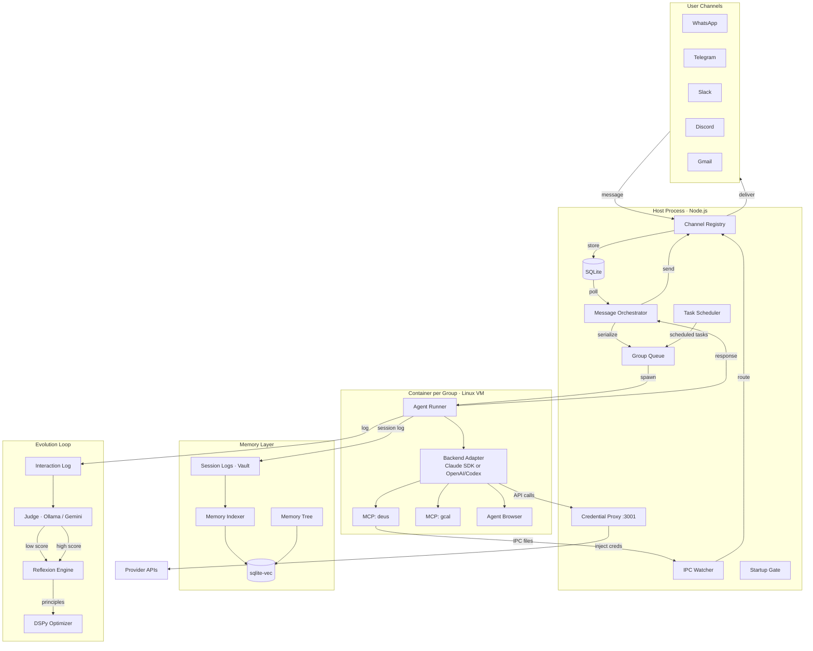
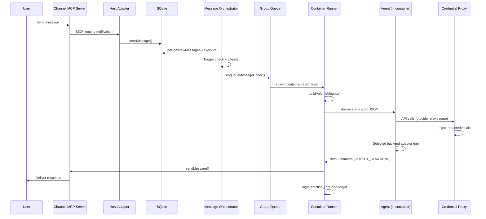
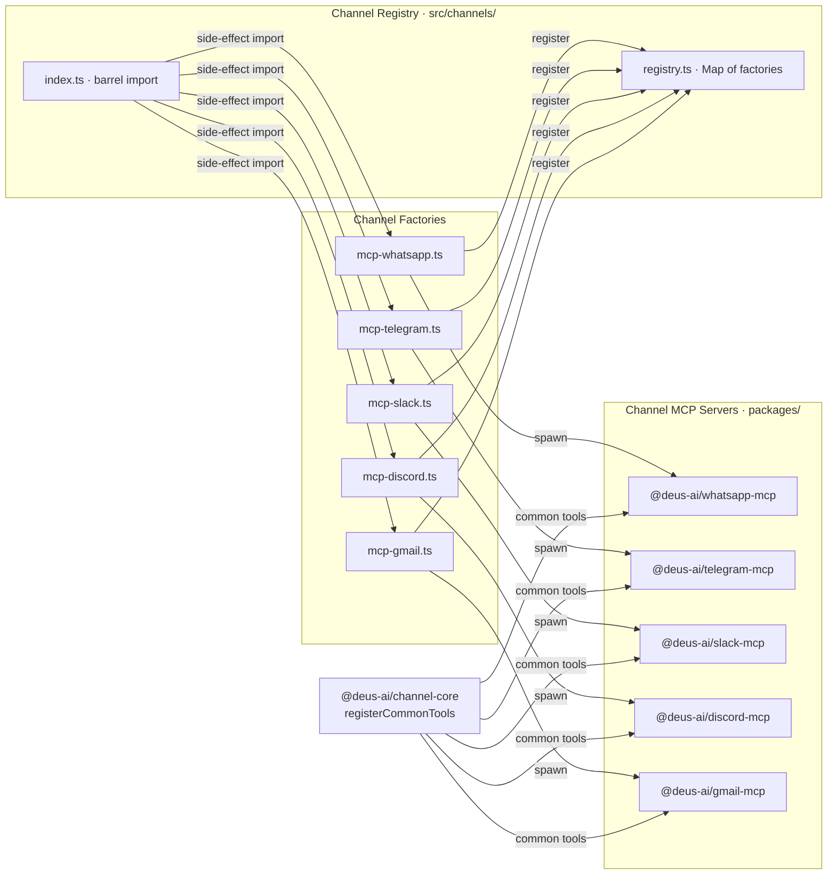
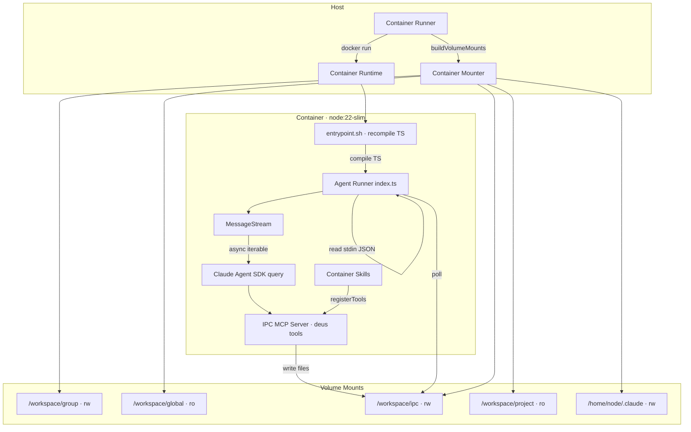
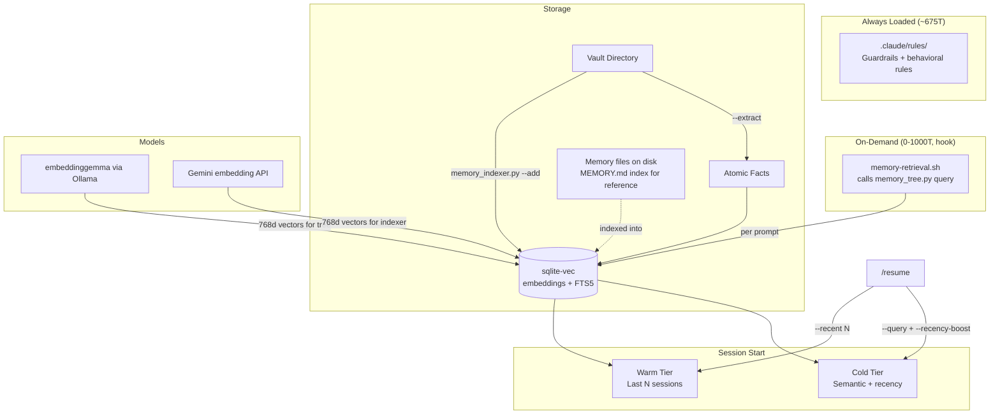
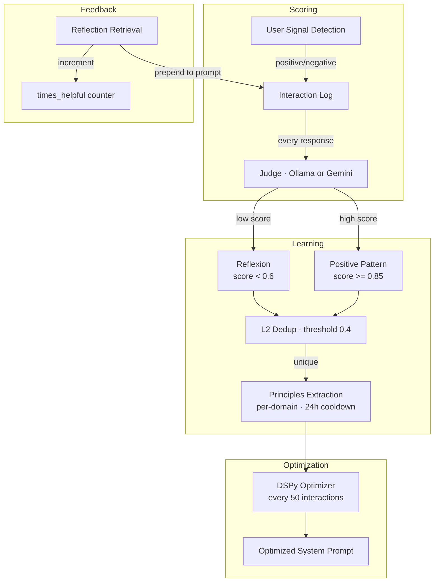
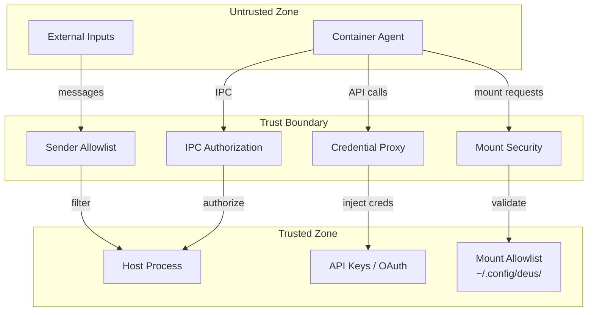
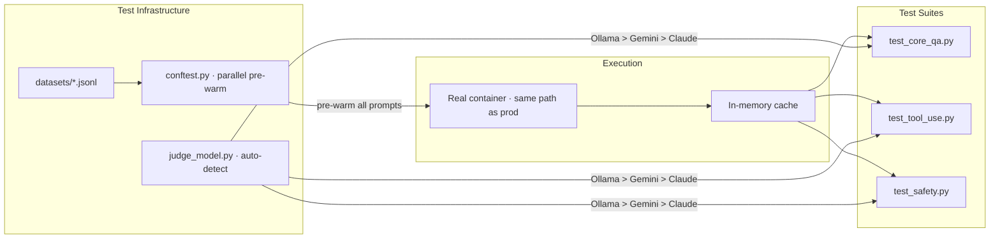

# Deus Architecture

> Canonical architecture reference. For setup and usage, see [README.md](../README.md).
> For environment variables, see [ENVIRONMENT.md](ENVIRONMENT.md).
> For architecture decision records, see [decisions/INDEX.md](decisions/INDEX.md).

## System Overview

Deus is a single Node.js process on the host. No microservices. Each conversation group runs in its own container with an isolated filesystem. The host never exposes API keys to containers — all API calls route through a credential proxy.

---

## Message Flow

Key details:
- **Channels are MCP servers** — each runs as a child process, communicating via JSON-RPC over stdio.
- **Message loop polls SQLite**, not the channels directly. This decouples channel connectivity from message processing.
- **Group queue** enforces one container per group. Follow-up messages pipe to the active container via IPC files; they don't spawn a new one.
- **Containers never see credentials** — backend adapters use provider-specific proxy routes (`ANTHROPIC_BASE_URL`, `OPENAI_BASE_URL`, etc.), and the host injects real tokens at request time.

---

## Channel System

All channels follow the **registry pattern**:
1. Each factory module calls `registerChannel()` at import time (side-effect import from `src/channels/index.ts`).
2. At startup, `src/index.ts` iterates registered factories, passes shared callbacks, and connects channels that return non-null.
3. Factories return `null` when credentials are missing — unconfigured channels are silently skipped.
4. Each channel server is a standalone `@deus-ai/*-mcp` package built on `@deus-ai/channel-core`, which registers common tools (`send_message`, `send_typing`, `sync_groups`, etc.).

---

## Container System

- **Image**: `node:22-slim` + Chromium + `agent-browser` + `claude-code` CLI.
- **Entrypoint**: recompiles agent-runner TypeScript from `/app/src` to `/tmp/dist` at startup, allowing per-group customization without rebuilding the image.
- **MessageStream**: push-based async iterable that feeds follow-up messages (from IPC polling) to the SDK without closing the session.
- **IPC MCP Server**: exposes `send_message`, `schedule_task`, `list_tasks`, and other tools to the agent. All IPC goes through files in `/workspace/ipc/`.
- **Container skills**: compiled from `.claude/skills/*/agent.ts` at build time; loaded dynamically by `skill-mcp-registry.ts`.

### Volume mount rules

| Mount | Main group | Non-main groups | External project |
|-------|-----------|----------------|-----------------|
| Project root | `/workspace/project` (ro) | Not mounted | `/workspace/project` (rw) |
| Group folder | `/workspace/group` (rw) | `/workspace/group` (rw) | `/workspace/group` (rw) |
| Global memory | Implicit (project root) | `/workspace/global` (ro) | Not mounted |
| `.env` file | Shadowed with `/dev/null` | Shadowed with `/dev/null` | Shadowed with `/dev/null` |
| IPC | `/workspace/ipc` (rw) | `/workspace/ipc` (rw) | `/workspace/ipc` (rw) |
| Claude session | `/home/node/.claude` (rw) | `/home/node/.claude` (rw) | `/home/node/.claude` (rw) |

---

## Memory System

Three layers handle memory at different cost points. `autoMemoryEnabled` is `false` in project settings — no flat index is loaded per turn. The `memory-retrieval.sh` hook wraps `memory_tree.py query` and runs on every `UserPromptSubmit`.

### Enforcement layers

| Layer | What | Token cost | Scales? |
|-------|------|-----------|---------|
| **Rules** | `.claude/rules/` — guardrails, behavioral constraints | ~675T fixed | Bounded by curation |
| **Hook** | `memory-retrieval.sh` wrapping `memory_tree.py query` — semantic retrieval per prompt | 0-1000T on match (~63% of turns = 0T, measured over 357 prompts from hook telemetry) | Embedding-based, O(1) lookup |
| **Vault** | CLAUDE.md — project identity, state, and rules (always loaded because it defines who Deus is; compressed automatically when it grows) | ~3,400T at session start | Auto-compressed |

### Tiered retrieval

| Tier | Mechanism | Cost | When |
|------|-----------|------|------|
| **Warm** | Last N sessions by date (`--recent N`) | Free | Every `/resume` |
| **Cold** | Semantic search with recency re-ranking (`memory_indexer.py`) | One Gemini embedding call | Every `/resume` |
| **Tree** | Hierarchical walk from `MEMORY_TREE.md` root + `see_also` hops (`memory_tree.py`) | Local Ollama embedding | Cold-start, cross-branch queries |
| **Hook** | `memory_tree.py query` via `UserPromptSubmit` hook | Local Ollama embedding | Every prompt (abstains if no match) |

### Memory tree

On top of flat semantic search, memory notes form a tree rooted at `MEMORY_TREE.md`. Each note declares a parent and optional `see_also` cross-links. Retrieval walks from the root down the most relevant branches, then hops sideways via `see_also` to catch facts under a different topic than the query suggests.

- **Cold-start recall** — finds the right note on the first turn.
- **Cross-branch discovery** — surfaces facts the flat embedding wouldn't rank highly.
- **Auto-discovery** — new vault files are registered by a PostToolUse hook.
- **Self-healing** — `memory_tree.py check --auto-fix` repairs orphans and missing parents.
- **Abstention** — returns `abstained:true` instead of guessing, falling back to the persona index.

Gated by `DEUS_MEMORY_TREE=1`. Embeddings use local `embeddinggemma` via Ollama.

### Knowledge base architecture

Inspired by [Karpathy's LLM Knowledge Bases](https://x.com/karpathy/status/2039805659525644595), enhanced with ideas from [Zep/Graphiti](https://github.com/getzep/graphiti) (temporal knowledge graphs) and [Synapse](https://arxiv.org/html/2601.02744v2) (spreading activation):

1. **Raw storage** — session logs in vault, embeddings in sqlite-vec, FTS5 full-text index
2. **Atomic facts** — extracted with confidence scoring, temporal versioning, domain tagging, contradiction detection
3. **Semantic graph** — entity-relationship extraction with bi-temporal validity
4. **Compiled knowledge** — auto-generated indexes, periodic compression (weekly/monthly digests)
5. **Knowledge interface** — intent-classified retrieval, spreading activation for cross-domain synthesis

### Retrieval benchmarks

Evaluated on [LongMemEval-S](https://arxiv.org/abs/2410.10813) (ICLR 2025), 50 examples, local Ollama embeddings:

| Metric | Score |
|---|---|
| Recall@1 | 94% |
| Recall@3 | 98% |
| Recall@5 | 98% |
| Recall@10 | 100% |
| MRR | 0.96 |

Internal memory tree benchmark (90 queries, 7 categories): **0.878 score**, 0% wrong-confident rate. Spot-checks on behavioral queries: 10/10 pass with production hook threshold.

---

## Evolution Loop

### Data flow

1. **Interaction logging** — every agent response is logged with prompt, response, latency, tools used, group, session ID, domain tags, and user signal.
2. **Domain detection** (`src/domain-presets.ts`) — keyword-based tagging (engineering, marketing, study, etc.) at zero API cost.
3. **User signal detection** (`src/user-signal.ts`) — short follow-ups like "perfect" or "wrong" are explicit feedback.
4. **Judge scoring** — a judge LLM scores each interaction on quality (0.0-1.0).
5. **Reflexion** — scores below 0.6 trigger corrective reflexion; scores above 0.85 extract positive patterns. New reflections are deduplicated via L2 distance.
6. **Principles extraction** — auto-triggered after enough new data. Extracts 3-5 actionable per-domain principles.
7. **DSPy optimization** — once 20+ scored samples accumulate, DSPy tunes the system prompt per domain. Positive-signal interactions get 2x weight.
8. **`times_helpful` tracking** — each time a reflection is retrieved and used, its counter increments, surfacing the most useful reflections.

### Provider/registry pattern

All evolution backends follow the same pattern:

| Layer | Interface | Providers | Override env var |
|-------|-----------|-----------|-----------------|
| **Judge** | `JudgeProvider` | Ollama (priority 10), Gemini (20), Claude (30), Mock (0) | `EVOLUTION_JUDGE_PROVIDER` |
| **Generative** | `GenerativeProvider` | Gemini (10), Ollama (20), Mock (0) | `EVOLUTION_GEN_PROVIDER` |
| **Storage** | `StorageProvider` | SQLite (10) | `DEUS_STORAGE_PROVIDER` |

Auto-detection: lowest-priority available provider wins. Adding a new backend: implement the interface in `providers/`, register in `providers/__init__.py`.

---

## Security Model

- **Container isolation** — every agent runs in a Linux container. Non-root `node` user. `.env` shadowed with `/dev/null`.
- **Credential proxy** — containers route API calls through `localhost:3001`. The proxy injects real credentials so containers never see them. On Linux, binds to `docker0` bridge IP (not `0.0.0.0`).
- **Mount security** — additional mounts validated against an allowlist at `~/.config/deus/mount-allowlist.json` (outside project root, inaccessible to containers). Blocked patterns: `.ssh`, `.gnupg`, `.aws`, `.env`, credentials, private keys.
- **IPC authorization** — main group can send to any registered group. Non-main groups restricted to their own chat JID.
- **Per-channel privacy** — each channel can be configured with its own memory privacy allowlist via `/settings memory_privacy=public,internal,private`. Sensitive data is excluded by default.
- **Sender allowlist** — per-group sender filtering with allow/drop modes.
- **Message size limits** — inbound truncated at `MAX_MESSAGE_LENGTH` (default 50,000 chars).

---

## Eval Layer

- Tests spawn **real containers** (same path as production) via `agent_wrapper.py`.
- **Parallel pre-warm**: at session start, all unique prompts are run concurrently. Tests hit the in-memory cache instantly. Concurrency: `max(1, min(cpu_count, 8) // 2)`.
- **Judge selection**: auto-detects available judges in priority order (Ollama, Gemini, Claude).
- **Thresholds**: per-metric pass/fail thresholds in `eval/thresholds.json`.

---

## Host Module Map

Core modules in `src/`:

| Module | Role |
|--------|------|
| `index.ts` | Entry point: startup gate, channels, orchestrator, scheduler, IPC |
| `message-orchestrator.ts` | Message loop, trigger detection, cursor management, agent dispatch |
| `container-runner.ts` | Spawns containers, manages stdin/stdout protocol |
| `container-mounter.ts` | Builds volume mount arguments per group type |
| `container-runtime.ts` | Docker runtime abstraction (`CONTAINER_RUNTIME` env var) |
| `credential-proxy.ts` | HTTP proxy injecting API credentials into container requests |
| `db.ts` | SQLite operations (better-sqlite3) |
| `router.ts` | Outbound message routing, JID ownership resolution |
| `router-state.ts` | Per-group cursor state, session IDs, registered groups |
| `group-queue.ts` | Per-group serialization, global concurrency cap (`MAX_CONCURRENT_CONTAINERS`) |
| `ipc.ts` | File-based IPC watcher for cross-group communication |
| `task-scheduler.ts` | Cron/interval/once task dispatch |
| `session-commands.ts` | Host-side slash command registry (`/settings`, `/compact`) |
| `startup-gate.ts` | Prerequisite validation (fatal/warn/suggest) |
| `sender-allowlist.ts` | Per-group sender filtering |
| `mount-security.ts` | Volume mount validation against allowlist |
| `evolution-client.ts` | Node.js to Python evolution bridge (child_process) |
| `domain-presets.ts` | Keyword-based domain detection (zero API cost) |
| `user-signal.ts` | Detects explicit user feedback signals in follow-up messages |
| `project-registry.ts` | External project registration for CLI mode |
| `remote-control.ts` | Remote Claude Code session management |
| `transcription.ts` | Voice message transcription (Whisper on Apple Silicon) |
| `config.ts` | Environment variable loading and defaults |
| `env.ts` | `.env` file reader |
| `auth-providers/` | AuthProvider interface + Anthropic provider (API key + OAuth) |
| `channels/` | Channel registry + MCP adapter factories |
| `skills/` | Host-side skill IPC handler loader |

---

## Static Diagrams

For contexts where Mermaid doesn't render, static PNGs are available:

- [System overview](../assets/brand-production/diagrams/deus-channels-diagram.png)
- [Memory system](../assets/brand-production/diagrams/deus-memory-system-diagram.png)
- [Evolution loop](../assets/brand-production/diagrams/deus-evolution-diagram.png)
- [Security model](../assets/brand-production/diagrams/deus-security-diagram.png)
