# TUI Agent Orchestration Architecture

**Date:** 2026-05-03
**Status:** Implemented
**Related:** [parallel-agent-orchestration.md](parallel-agent-orchestration.md), [backend-strategy-trait.md](backend-strategy-trait.md), [tui-permission-bridge.md](tui-permission-bridge.md)

## Overview

The Deus TUI is a terminal UI that orchestrates one main agent session and N
parallel background agent sessions. Each session is an independent Claude Code
(or Codex) subprocess. The TUI manages lifecycle, communication, permissions,
and user context across all sessions.

## High-Level Architecture

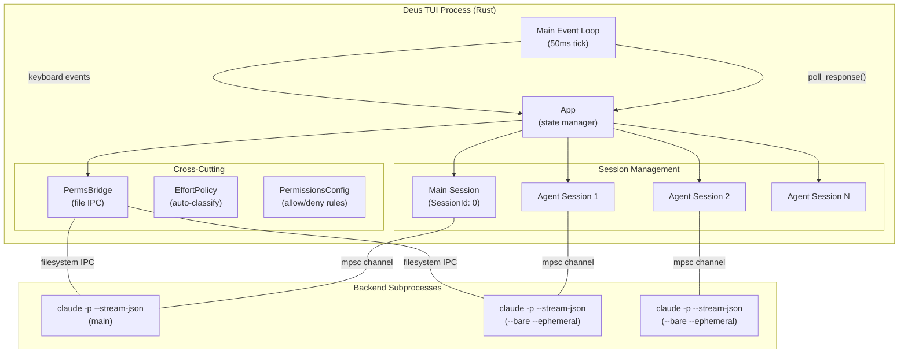

## Session Lifecycle

```mermaid
stateDiagram-v2
    [*] --> Idle: Session created
    Idle --> Streaming: dispatch_message()
    Streaming --> Idle: ChunkKind::Done (main)
    Streaming --> Completed: ChunkKind::Done (background)
    Streaming --> Failed: error + Done
    Completed --> [*]: auto-GC (immediate)
    Failed --> [*]: auto-GC (immediate)
    Streaming --> Idle: cancel_response()

    note right of Streaming
        Background sessions have
        a timeout thread that sends
        Kill after DEUS_AGENT_TIMEOUT_SECS
    end note

    note right of Completed
        Completion summary posted
        to main session before removal
    end note
```

## Communication Flow: Main Session

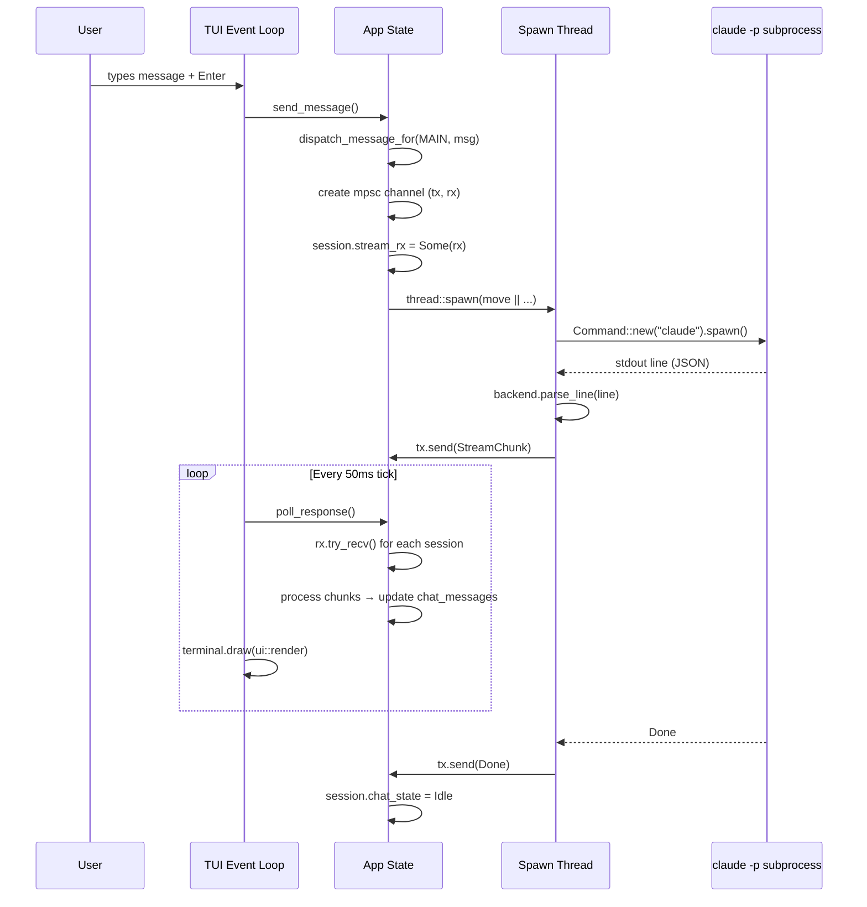

## Communication Flow: Background Agent

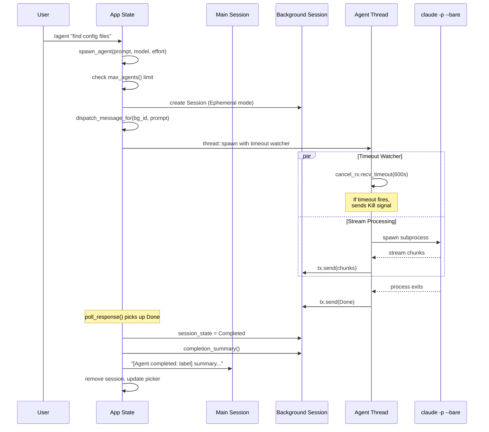

## Backend Strategy Pattern

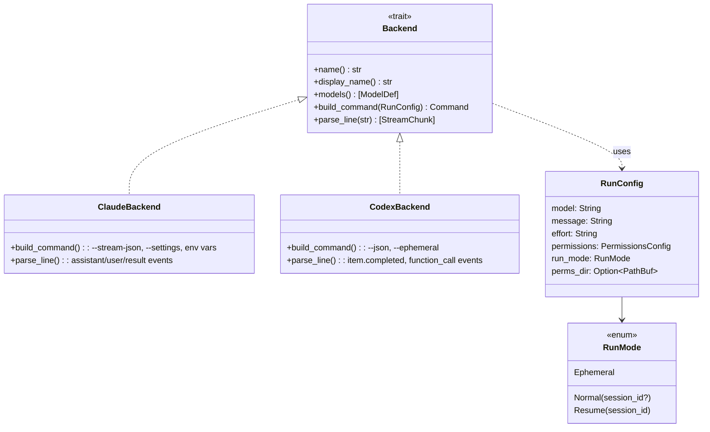

## Stream Chunk Processing

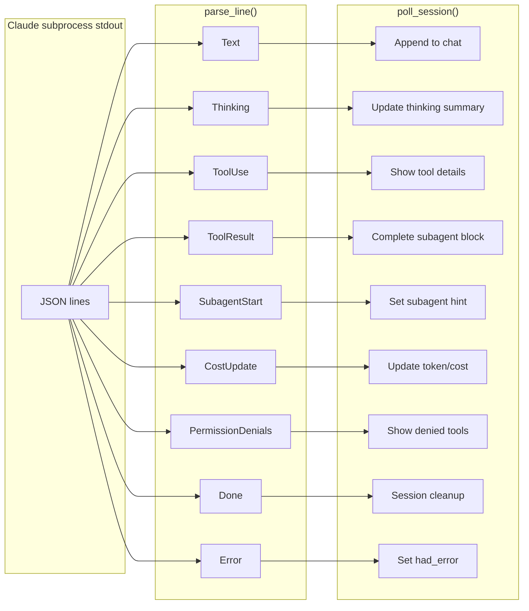

## Permission Bridge Integration

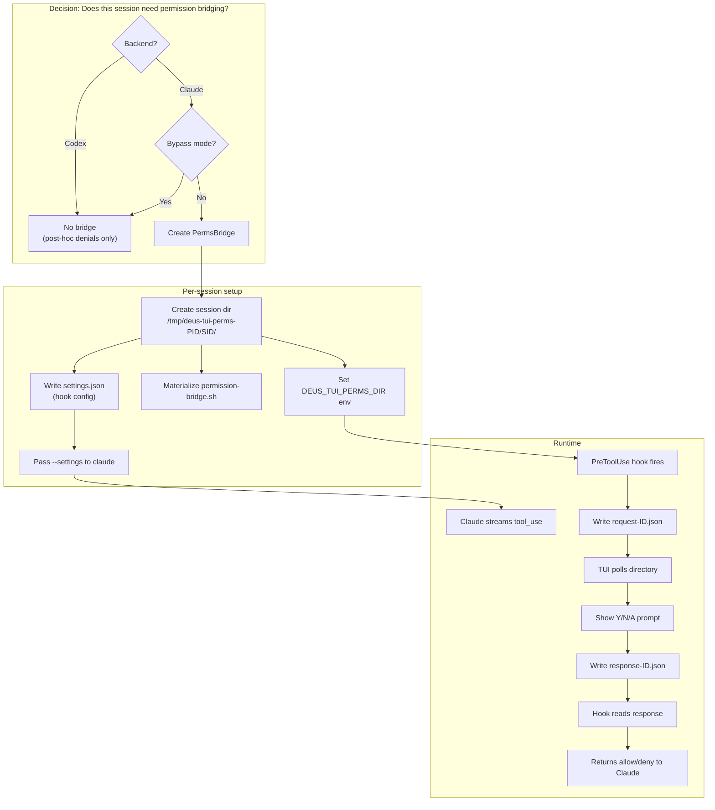

## Concurrent Agent Limit

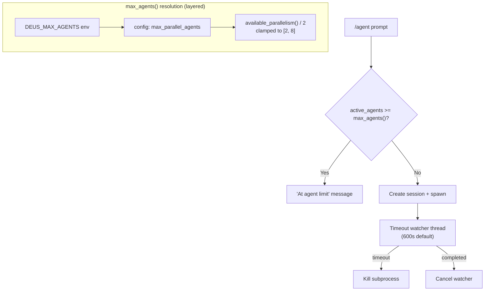

## Alternatives Considered for Agent Communication

### Option A: Shared Thread Pool (rejected)

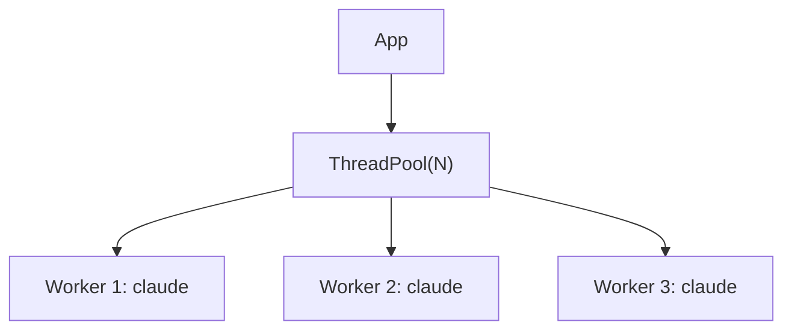

**Pros:** Bounded concurrency built-in, simpler resource management.
**Cons:** Claude Code processes are long-running (minutes). Thread pools are designed
for short tasks. Blocking a pool thread for minutes starves other work. The
`max_agents()` limit achieves the same bound without pool overhead.

### Option B: Async Runtime (rejected)

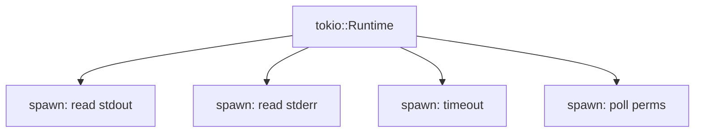

**Pros:** Natural fit for I/O-bound work. `select!` for concurrent waits.
**Cons:** Adds tokio as a dependency (~1MB+ binary size). Ratatui's event loop
is synchronous. Mixing async and sync requires `block_on` bridges that negate
the benefit. The 50ms poll loop with `try_recv()` is simpler and sufficient
for the human-interaction latency target.

### Option C: Single Multiplexed Process (rejected)

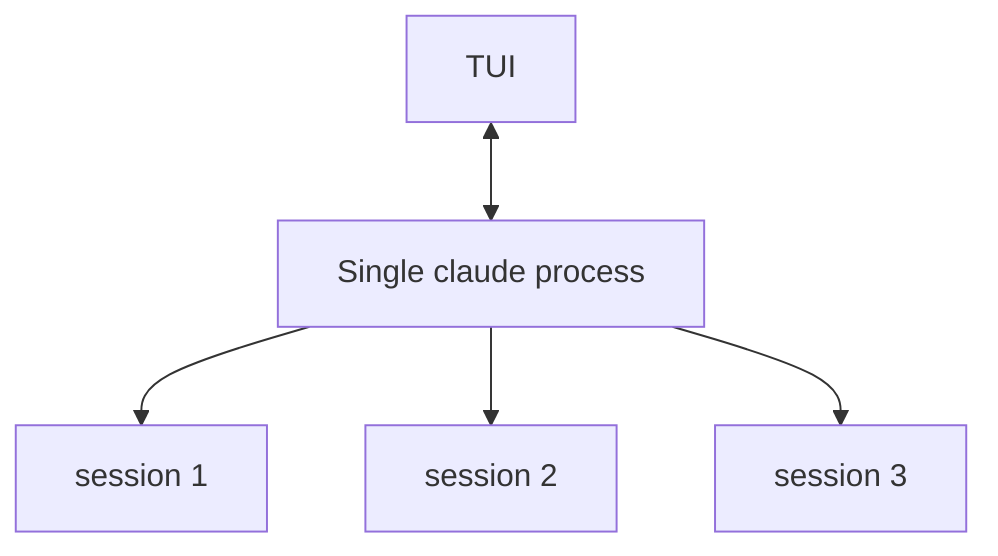

Run one Claude Code process and multiplex sessions over its stdin/stdout.

**Pros:** Single process, lower resource usage.
**Cons:** Claude Code's `-p` mode is single-prompt. No multiplexing protocol exists.
Sessions across different models or backends are impossible. Process crash kills
all sessions.

### Selected: Independent Subprocesses with mpsc Channels

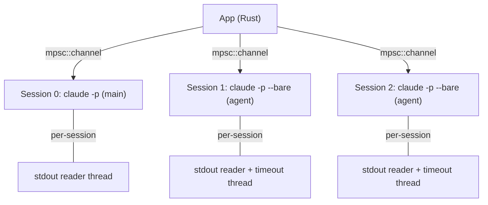

**Why:** Each session is an independent subprocess. Crash isolation is free.
Different models/backends per session is trivial. `mpsc::channel` is zero-cost
on idle sessions. The 50ms poll loop processes all channels in one pass.

## Comparison Matrix

| Criterion | Independent Processes | Thread Pool | Async Runtime | Multiplexed |
|---|---|---|---|---|
| Crash isolation | Per-session | Per-session | Per-session | All-or-nothing |
| Multi-backend | Trivial | Trivial | Trivial | Impossible |
| Complexity | Low | Medium | High | Extreme |
| Dependencies | std only | crossbeam | tokio | Custom protocol |
| Resource overhead | 1 process/session | 1 thread/session | 1 task/session | 1 process total |
| Latency | ~50ms poll | ~50ms poll | ~0ms await | ~0ms stdin |
