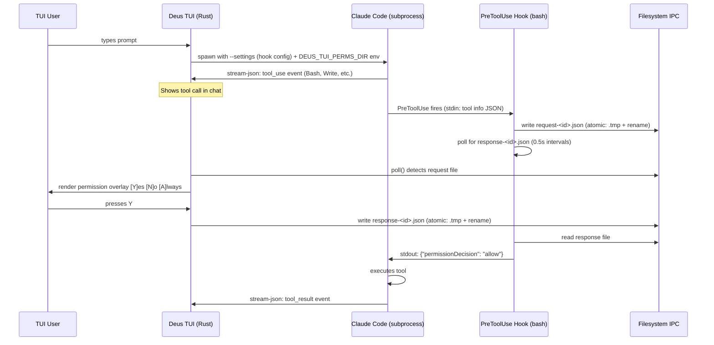
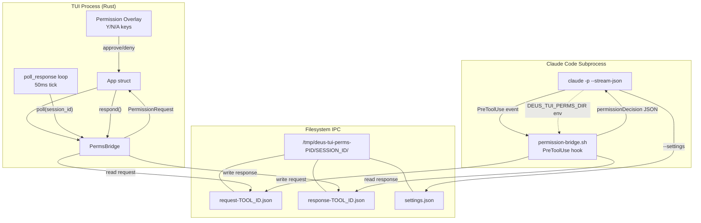
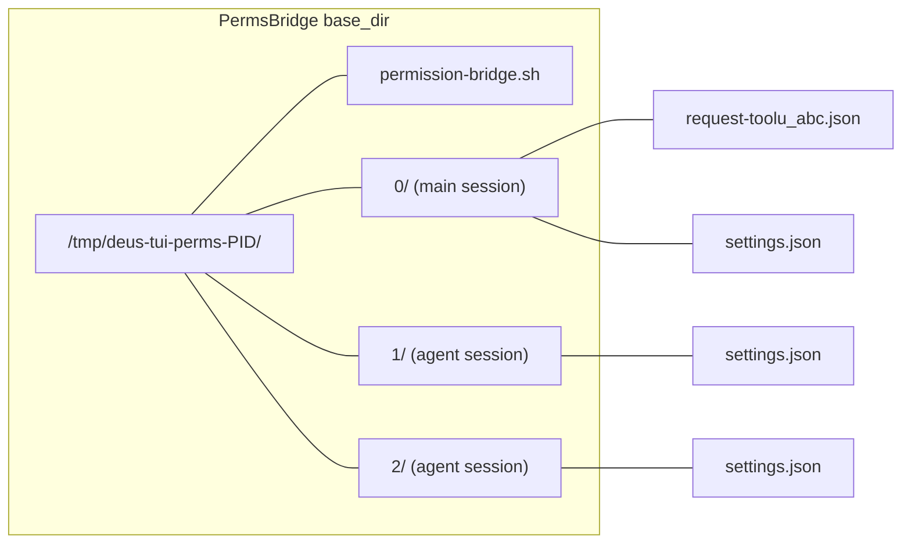
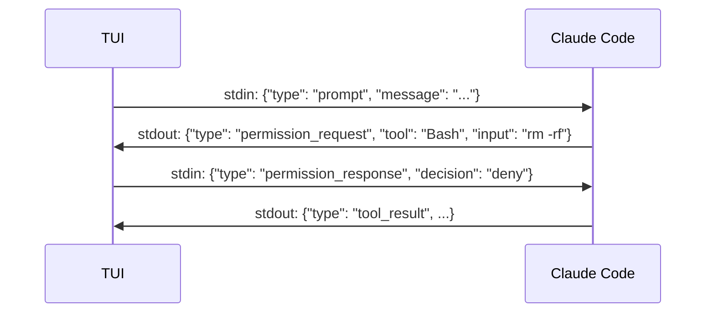
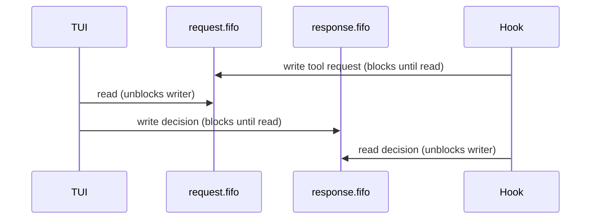
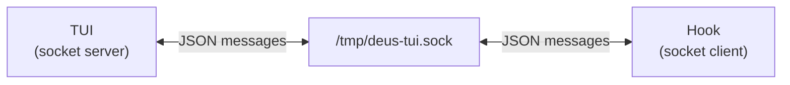

# TUI Permission Bridge

**Date:** 2026-05-03
**Status:** Implemented (Phase 1)
**Related:** [parallel-agent-orchestration.md](parallel-agent-orchestration.md), [backend-strategy-trait.md](backend-strategy-trait.md)

## Problem

The Deus TUI runs Claude Code in piped mode (`claude -p --output-format stream-json`).
In this mode, permission prompts have no interactive path — tool calls that require
approval are silently denied and reported post-hoc via `permission_denials` in the
`result` event. Users see what failed but can never approve anything.

## Architecture

### Selected: Hook-Based File IPC Bridge

### Component Diagram

### Session Isolation

Each session gets its own subdirectory to prevent cross-session ID collisions.
The hook script is shared (embedded via `include_str!` at compile time).

## Alternatives Considered

### Option A: Stdin/Stdout Bidirectional JSON (rejected)

**Pros:**
- No filesystem involvement
- Lower latency (direct pipe)
- Cleaner architecture (single communication channel)

**Cons:**
- Claude Code does not document or support `permission_request` events in stream-json output
- `--input-format stream-json` exists but the permission response schema is undocumented
- Would require reverse-engineering an internal protocol
- Fragile across Claude Code version upgrades

**Why rejected:** The bidirectional JSON protocol is not a public API. Building on it
risks breakage with every Claude Code update.

### Option B: Named Pipe (FIFO) IPC (considered, deferred)

**Pros:**
- No polling needed (blocking I/O)
- Lower latency than file polling
- No orphan file cleanup

**Cons:**
- Harder to debug (can't `ls` and `cat` files during development)
- Blocking semantics require careful ordering (deadlock risk)
- Not available on Windows (though TUI is macOS/Linux only)
- Multiple concurrent permissions per session would need multiplexing

**Why deferred:** File polling at 0.5s is fast enough for human interaction speed.
FIFOs add complexity without meaningful UX improvement. Could revisit if latency
becomes noticeable.

### Option C: Unix Domain Socket (considered, rejected)

**Pros:**
- Full duplex, low latency
- Supports multiplexed concurrent requests
- Clean shutdown semantics

**Cons:**
- Significantly more code (socket server in Rust, client in bash)
- Shell hooks can't easily do socket I/O (need netcat or Python)
- Overkill for the request/response pattern at human-interaction speed

**Why rejected:** The shell hook script needs to be simple and portable.
Socket I/O from bash requires external tools and adds fragility.

### Option D: Global Config Mutation (rejected)

Instead of `--settings`, modify `~/.claude/settings.json` before each launch.

**Pros:**
- No `--settings` flag needed

**Cons:**
- Affects every Claude Code session on the host
- Race condition with concurrent sessions
- Requires cleanup on crash
- Violates the "no global state mutation" principle

**Why rejected:** Per-invocation `--settings` is strictly better.

## Comparison Matrix

| Criterion | File IPC (chosen) | Bidirectional JSON | FIFO | Unix Socket | Global Config |
|---|---|---|---|---|---|
| Complexity | Low | Unknown | Medium | High | Low |
| Debuggability | Excellent | Poor | Poor | Medium | Medium |
| Latency | ~500ms | ~0ms | ~0ms | ~0ms | N/A |
| Stability | High | Fragile | High | High | Fragile |
| Shell compat | Native | N/A | Native | Needs tools | Native |
| Crash cleanup | Sweep orphans | N/A | Auto | Auto | Manual |
| Platform | POSIX | Any | POSIX | POSIX | Any |

## Key Design Decisions

1. **`--settings` per-invocation** — No global config mutation. Each subprocess gets
   its own settings JSON via CLI flag.

2. **Atomic file writes** — `.tmp` + `rename()` prevents partial reads. POSIX guarantees
   `rename()` is atomic within the same filesystem.

3. **Per-session directories** — Prevents tool_use_id collisions between concurrent
   background agents.

4. **120s timeout with deny fallback** — If the user doesn't respond, the tool is denied.
   Configurable via `DEUS_TUI_PERMS_TIMEOUT` env var.

5. **Claude-only for v1** — Codex has no hook system. Codex sessions use the existing
   `PermissionDenials` post-hoc reporting path.

6. **Orphan sweep on startup** — `PermsBridge::sweep_orphans()` removes temp dirs from
   crashed TUI instances by checking if the owning PID is still alive.

## Scope

- **Phase 1 (this PR):** IPC bridge, hook script, backend integration, keyboard shortcuts (Y/N/A)
- **Phase 2 (future):** Full TUI overlay with tool details, input preview, session context
- **Phase 3 (future):** "Always allow" persistence across sessions, pattern-specific rules
